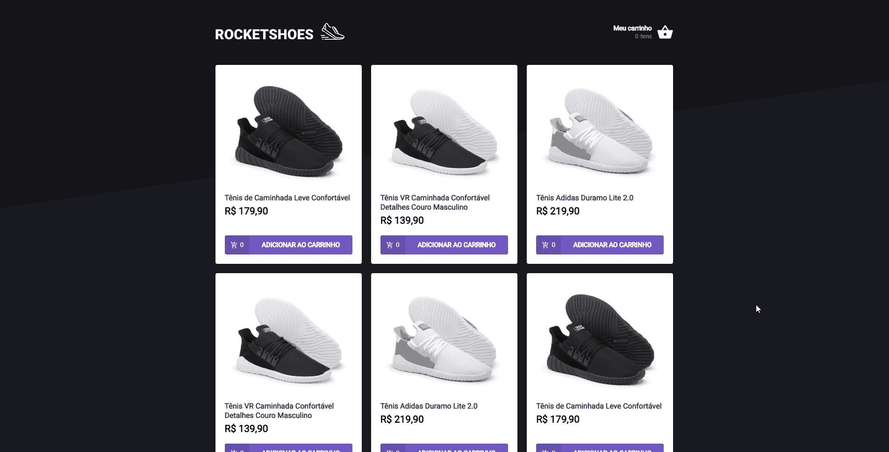

<h1 align="center">
  Rocketshoes
</h1>

<p align="center">
  <a href="#-features">Features</a>&nbsp;&nbsp;&nbsp;|&nbsp;&nbsp;&nbsp;
  <a href="#-technologies">Technologies</a>&nbsp;&nbsp;&nbsp;|&nbsp;&nbsp;&nbsp;
  <a href="#-project">Project</a>&nbsp;&nbsp;&nbsp;|&nbsp;&nbsp;&nbsp;
  <a href="#-starting">Starting</a>&nbsp;&nbsp;&nbsp;|&nbsp;&nbsp;&nbsp;
  <a href="#memo-license">License</a>
</p>

<p align="center">
  
  
  

  
</p>

<br>

<p align="center">
  
</p>

## ✨ Features

✔️ Show product subtotal individually in the cart\
✔️ Show total cart value\
✔️ Consult the API to check if the quantity of the product is available in stock\
✔️ Remove product from cart

## 🚀 Technologies

The following tools were used in this project:

- [React](https://pt-br.reactjs.org/)
- [TypeScript](https://www.typescriptlang.org/)
- [Styled Components](https://styled-components.com/)
- [JSON Server](https://www.npmjs.com/package/json-server)

## 💻 Project

Rocketshoes is a shoes e-commerce website. It was the third challenge from the Ignite course. The objective of this challenge is to implement a couple of functionalities on its components, pages and hooks.

## 🏁 Starting

```bash
# Clone this project
$ git clone https://github.com/murilorvargas/rocketshoes
# Access
$ cd rocketshoes
# Install dependencies
$ yarn
# Run JSON server
$ yarn server
```

Now run on another terminal:

```bash
# Run the project
$ yarn start
# The server will initialize in the <http://localhost:3000>
```

## :memo: License

This project is under license from MIT. For more details, see the [LICENSE](LICENSE) file.
